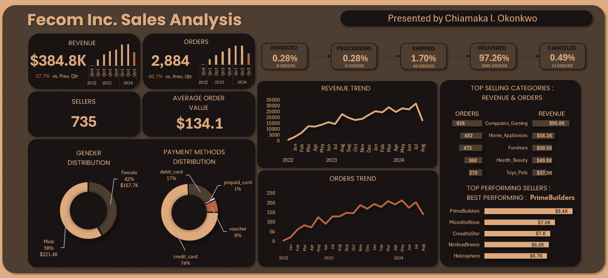

# Fencom Inc. Sales Performance Analysis – Excel Dashboard Project
Cleaned and analyzed UK e-commerce sales in Excel; built a dynamic dashboard showing trends, top categories, payment methods, and seller performance for strategic business insights.

---

---

## About the Business 🏢

Fencom Inc. is a growing e-commerce company in the UK that offers a wide range of high-quality products across categories like Computers & Gaming, Fashion, Health & Beauty, and Home Appliances. This project leverages data analytics to explore and understand Fencom’s sales performance using Microsoft Excel. Fencom’s goal is to create a smooth and satisfying shopping experience by using data to guide strategic decisions.

---

## Problem Statement ❓

Despite active operations and broad product offerings, Fencom Inc. lacked detailed, data-backed insights into its sales dynamics. 
This project was initiated to:
- Identify key revenue drivers.
- Detect underperforming categories.
- Examine seasonal trends and regional differences.
- Explore the influence of price, freight, and payment methods on sales.
Without these insights, critical decisions around marketing, inventory, and operations risk being misinformed.

---

## Project Objectives 🎯

This analysis aims to answer the following key questions:
- What are the overall sales trends?
- Which products and sellers perform best?
- What are the most used payment methods?
- Are there seasonal or time-based fluctuations in sales?
- Are there differences in sales by gender or region?
- What delivery stages have the most activity?

---

## Dataset Overview 🗂️

The raw Excel [dataset](Fencom_Inc_Dataset.xlsx) contains details such as:
- Products sold
- Product categories
- Unit price
- Freight cost 
- Order Quantities 
- Payment methods
- Customer locations
- Order dates

---

## Tools and Features Used 🛠️

Excel Features:
1. Functions like SUMIFS, TEXT, VLOOKUP and COUNTIF for calculations.
2. Pivot Tables to group and summarize data.
3. Charts (bar, line, pie) to visualize trends.
4. A polished Excel dashboard for Data Visualization to enable decision making.

---

## Data Cleaning and Transformation 🔍

The dataset (Fecom_Inc_Dataset.xlsx) was cleaned to removed blanks, standardized formats, remove duplicate entries.

The inconsistencies in the product category and gender fields were fixed (inconsistent spelling of gender and product categories).

---

## Data Analysis & Visualizations 📊

Created calculated **metrics** to give insight into: 
1. Orders placed and Revenue generated by different Genders
2. The Sellers who made the most sales
3. Customers’ preferred Payment Methods
4. Revenue generated from each product category and the Top 5 products with the most revenue generated.
5. The most transactions made per product category
6. Sales and Order Trends

Created **KPI’s** to show:				
1. Total Revenue Generated
2. Total Orders
3. Total Sellers
4. Summary of orders based on Freight Status
5. Average Order Value

---

## Key Metrics 📈

From the Dashboard above, the following were some of the key metrics:
- **Total Revenue:** $384.8K (↓ 37.7% vs. previous quarter)
- **Total Orders:** 2,884 (↓ 40.7% vs. previous quarter)
- **Average Order Value:** $134.1
- **Total Sellers:** 735
- **Top Categories by Revenue:**
  - Computers & Gaming: $95.8K
  - Home Appliances: $58.2K
  - Furniture: $50.5K
- **Top Sellers:**
  - PrimeBuilders ($9.4K)
  - MicroliteWave, CreditStar, NimbusBreeze

---

## Key Visual Insights 📊

**Revenue & Orders Over Time:** Growth from 2022–2024, but with a dip in Q3 2024.

**Gender Distribution:** Male buyers generated 58% of the revenue.

**Payment Methods:** 74% of orders were paid using credit cards.

**Order Fulfilment:** 97.3% of orders were successfully delivered.

---

## Business Insights & Recommendations 💡

**Focus on High-Performing Categories:** Especially Computers & Gaming.

**Optimize Q3 Strategies:** Address revenue dip seen in this quarter.

**Leverage Credit Card Promotions:** Given its dominance among payment methods.

**Expand Support for Top Sellers:** Help scale performance across more product categories.

**Gender-Specific Campaigns:** With males contributing a higher share, test targeted offers for female shoppers.

---

## Final Thoughts ✅

This project shows how Excel can be a powerful tool for turning raw data into business intelligence for strategic planning in sales, marketing, and operations. 
With interactive dashboards, slicers, and visuals, the stakeholders at Fencom Inc. can now monitor performance in real-time, identify what’s working, and respond quickly to market needs.

